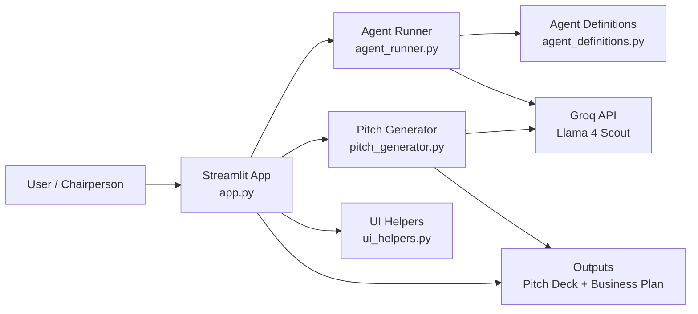
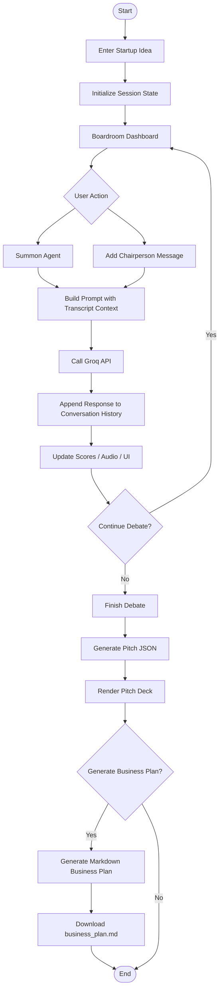

# AI Boardroom Diagrams

This file contains reusable Mermaid diagrams for the project.

## High-Level Architecture

```mermaid
flowchart LR
    U[User / Chairperson]
    S[Streamlit App<br/>app.py]
    A[Agent Runner<br/>agent_runner.py]
    D[Agent Definitions<br/>agent_definitions.py]
    P[Pitch Generator<br/>pitch_generator.py]
    UI[UI Helpers<br/>ui_helpers.py]
    G[Groq API<br/>Llama 4 Scout]
    O[Outputs<br/>Pitch Deck + Business Plan]

    U --> S
    S --> UI
    S --> A
    A --> D
    A --> G
    S --> P
    P --> G
    P --> O
    S --> O
```

## End-to-End User Flow

```mermaid
flowchart TD
    Start([Start]) --> Idea[Enter Startup Idea]
    Idea --> Init[Initialize Session State]
    Init --> Dash[Boardroom Dashboard]

    Dash --> Choice{User Action}
    Choice --> Summon[Summon Agent]
    Choice --> Speak[Add Chairperson Message]

    Summon --> Build[Build Prompt with Transcript Context]
    Speak --> Build
    Build --> Call[Call Groq API]
    Call --> Append[Append Response to Conversation History]
    Append --> Update[Update Scores / Audio / UI]

    Update --> More{Continue Debate?}
    More -->|Yes| Dash
    More -->|No| Finish[Finish Debate]

    Finish --> Pitch[Generate Pitch JSON]
    Pitch --> Render[Render Pitch Deck]
    Render --> PlanQ{Generate Business Plan?}
    PlanQ -->|Yes| Plan[Generate Markdown Business Plan]
    Plan --> Download[Download business_plan.md]
    Download --> End([End])
    PlanQ -->|No| End
```
